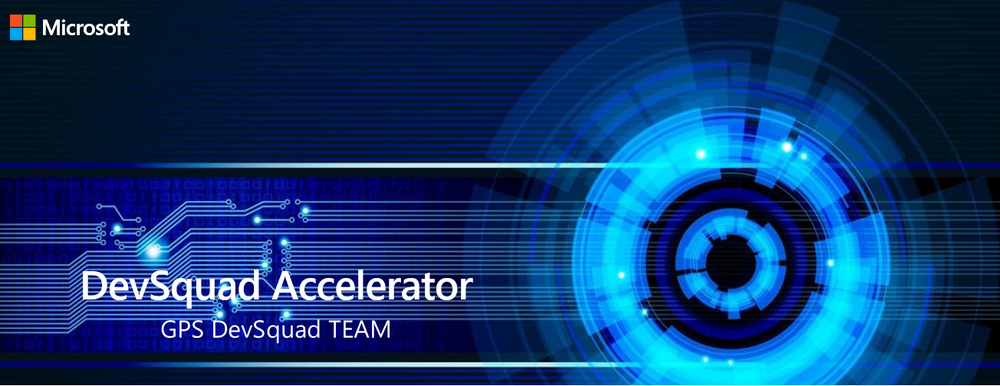

 
 

# DevSquad Solution Accelerators

Developed by the Microsoft GPS DevSquad Team, the DevSquad Solution Accelerators are different repositories that provide a set of tools and templates to help you accelerate your development process in varios context like DataOps, MLOps and DevSecOps. The DevSquad Solution Accelerators are designed to help you build solutions that are secure, scalable, and reliable. The DevSquad Solution Accelerators are built on top of the Microsoft Azure platform and are designed to be used with the Microsoft Azure DevOps platform or GitHub.

 
 

## Summary Table of DevSquad Solution Accelerators
Below is a summary list of the DevSquad Solution Accelerators:
 
 

<table>
    <thead>
        <tr>
            <th>Name</th>
            <th>Description</th>
            <th>Services or Architecture Reference</th>
            <th>Link</th>
        </tr>
    </thead>
    <tbody>
        <tr>
            <td rowspan=9><b>DevSquad DevSecOp</b></td>
            <td rowspan=9>In these workshops, you will learn how to build and deploy modern Cloud-Native apps based on reference arquitectures, supported by best practices of <a href="https://github.com/microsoft/code-with-engineering-playbook/blob/main/docs/ENG-FUNDAMENTALS-CHECKLIST.md">Software Engineering</a> and <a href="https://docs.microsoft.com/en-us/azure/architecture/solution-ideas/articles/devsecops-in-github">Secure DevOps Practices</a>.   Reference architecture <a href="https://learn.microsoft.com/en-us/azure/architecture/solution-ideas/articles/devsecops-in-github">DevSecOps in Azure</a></td>
            <td>Infrastructure as code, reference architecture: <a href="https://docs.microsoft.com/en-us/azure/architecture/solution-ideas/articles/devsecops-infrastructure-as-code">DevSecOps for infrastructure as code (IaC)</a></td>
            <td><a href="https://github.com/oaviles/hello_iac">DevSquad IaC Accelerator</a></td>
        </tr>
        <tr>
            <td>Deploy ASP.Net Code Application on Azure, reference architectures: <a href="https://docs.microsoft.com/en-us/azure/architecture/solution-ideas/articles/devsecops-in-github">Deploy Web App on Azure</a></td>
            <td><a href="https://github.com/oaviles/hello_appservice">DevSquad App Service Accelerator</a></td>
        </tr>
        <tr>
            <td>Deploy Serverless Application on Azure, reference architectures: <a href="https://docs.microsoft.com/en-us/azure/architecture/reference-architectures/serverless/cloud-automation">Deploy event driven architecture on Azure</a></td>
            <td><a href="https://github.com/oaviles/hello_serverless">DevSquad Serverless Accelerator</a></td>
        </tr>
        <tr>
            <td>Azure Spring Cloud, reference architecture: <a href="https://docs.microsoft.com/en-us/azure/architecture/example-scenario/blue-green-spring/blue-green-spring">Deployment for Applications on Azure Spring Cloud</a></td>
            <td><a href="https://github.com/oaviles/hello_springcloud">DevSquad Spring Cloud Accelerator</a></td>
        </tr>
        <tr>
            <td>Deploy Microservice on Azure Kubernetes Service, reference architecture: <a href="https://docs.microsoft.com/en-us/azure/architecture/reference-architectures/containers/aks-microservices/aks-microservices">Deploy microservice on AKS</a></td>
            <td><a href="https://github.com/oaviles/hello_cloud-native">DevSquad Kubernetes Accelerator</a></td>
        </tr>
        <tr>
            <td>Azure Red Hat OpenShift, reference architecture: <a href="https://docs.microsoft.com/en-us/azure/cloud-adoption-framework/scenarios/app-platform/azure-red-hat-openshift/landing-zone-accelerator">ARO Reference Architecture</a></td>
            <td><a href="https://github.com/oaviles/hello_ARO">DevSquad Azure Red Hat OpenShift Accelerator</a></td>
        </tr>
        <tr>
            <td>Deploy a <a href="https://docs.microsoft.com/en-us/azure/architecture/solution-ideas/articles/devsecops-in-github">DevOps reference arquitecture</a></td>
            <td><a href="https://github.com/oaviles/DevSquad/tree/main/DevOps_Wizard">DevSquad DevOps Accelerator</a></td>
        </tr>
        <tr>
            <td>Deploy a <a href="https://docs.microsoft.com/en-us/azure/architecture/reference-architectures/iot">IoT reference arquitecture</a></td>
            <td><a href="https://github.com/luisruval/DevSquad-IoT">DevSquad IoT Accelerator</a></td>
        </tr>
        <tr>
            <td><a href="https://docs.microsoft.com/en-us/learn/modules/intro-to-java-azure/5-deployment-opportunities">Build or Migrate Java Web Apps</a></td>
            <td><a href="https://github.com/oaviles/hello_java">DevSquad Java on Azure Accelerator</a></td>
        </tr>
        <tr>
            <td><b>DevSquad DataOps</b></td>
            <td>In this workshop, you will deploy a DataOps reference arquitecture, for understanding best practices of Data Engineering & Software Engineering combined.</td>
            <td>ARM Templates, Azure DevOps, Azure Data Factory, Azure Databricks</td>
            <td><a href="https://github.com/microsoft/devsquad-dataops">DevSquad DataOps</a></td>
        </tr>
        <tr>
            <td><b>DevSquad MLOps</b></td>
            <td>In this workshop, you will deploy a MLOps reference arquitecture. It demostrates how apply the worflow in a sample project along with a CI/CD implementation for Azure DevOps.</td>
            <td>ARM Templates, Azure DevOps, Azure Machine Learning</td>
            <td><a href="https://github.com/microsoft/devsquad-mlops">DevSquad MLOps</a></td>
        </tr>
    </tbody>
</table>

                

## Contributing

This project welcomes contributions and suggestions.  Most contributions require you to agree to a
Contributor License Agreement (CLA) declaring that you have the right to, and actually do, grant us
the rights to use your contribution. For details, visit https://cla.opensource.microsoft.com.

When you submit a pull request, a CLA bot will automatically determine whether you need to provide
a CLA and decorate the PR appropriately (e.g., status check, comment). Simply follow the instructions
provided by the bot. You will only need to do this once across all repos using our CLA.

This project has adopted the [Microsoft Open Source Code of Conduct](https://opensource.microsoft.com/codeofconduct/).
For more information see the [Code of Conduct FAQ](https://opensource.microsoft.com/codeofconduct/faq/) or
contact [opencode@microsoft.com](mailto:opencode@microsoft.com) with any additional questions or comments.

## Trademarks

This project may contain trademarks or logos for projects, products, or services. Authorized use of Microsoft 
trademarks or logos is subject to and must follow 
[Microsoft's Trademark & Brand Guidelines](https://www.microsoft.com/en-us/legal/intellectualproperty/trademarks/usage/general).
Use of Microsoft trademarks or logos in modified versions of this project must not cause confusion or imply Microsoft sponsorship.
Any use of third-party trademarks or logos are subject to those third-party's policies.
